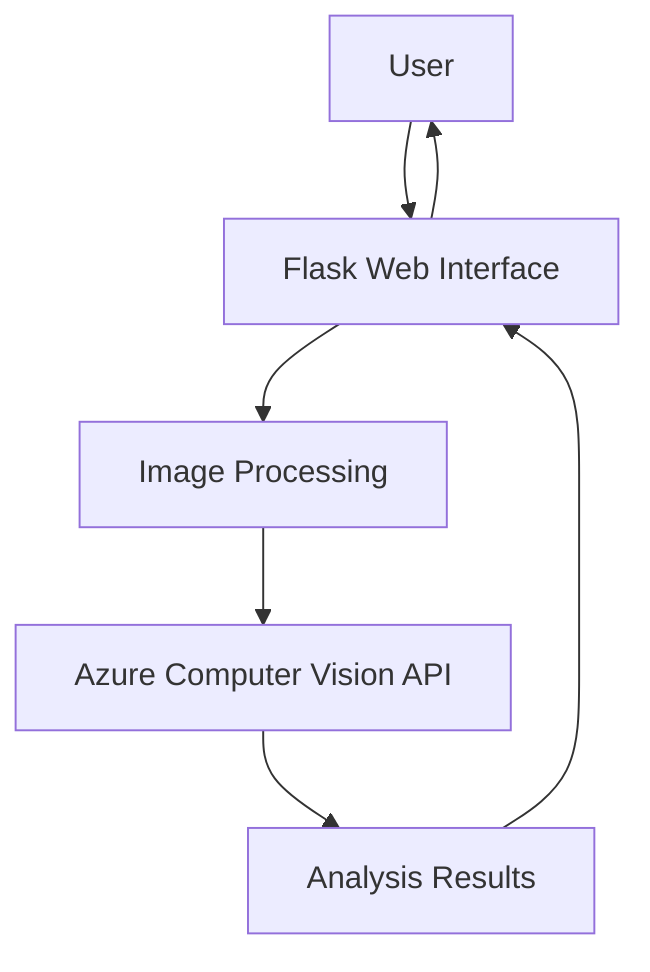

# ImageInsight 🔍📸

[](https://opensource.org/licenses/MIT)
[](https://www.python.org/)
[](https://flask.palletsprojects.com/)

A web application powered by **Azure Computer Vision** that provides AI-powered image analysis. Upload any image to get instant insights including tags, descriptive captions, and detected objects.

 <!-- Replace with your actual demo GIF -->

## 🌟 Features

- **Smart Image Analysis**
  - **Tags**: Automatic labeling of objects/scenes (e.g., "mountain", "car")
  - **Captions**: AI-generated descriptive sentences
  - **Objects**: Specific detected items with confidence scores
- **File Handling**
  - Auto-resizing for Azure compatibility (≤4MB, ≤4200px)
  - Supports JPG, PNG, BMP, GIF formats
- **Secure Configuration**
  - Environment variable protection for API keys
  - Input validation and error handling

## 🛠️ Tech Stack

**Backend**  


**Frontend**  


## 🚀 Getting Started

### Prerequisites

- Python 3.8+
- [Azure Account](https://azure.microsoft.com/) (Free tier available)
- Git (for version control)

### Installation

1. **Clone the Repository**
   ```bash
   git clone https://github.com/your-username/ImageInsight.git
   cd ImageInsight
   ```

2. **Install Dependencies**
   ```bash
   pip install -r requirements.txt
   ```

3. **Azure Setup**
   - Create a Computer Vision resource in [Azure Portal](https://portal.azure.com/)
   - Get your:
     - **API Key**
     - **Endpoint URL**

4. **Configure Environment**
   Create `.env` file:
   ```plaintext
   API_KEY=your_azure_key_here
   ENDPOINT=your_azure_endpoint_here
   ```

5. **Run the Application**
   ```bash
   python app.py
   ```
   Visit ➡️ `http://localhost:5000`

## 🏗️ Architecture



## 📂 Project Structure

```
ImageInsight/
├── app.py                 # Main application logic
├── requirements.txt       # Dependency list
├── README.md              # This documentation
├── .gitignore             # Ignored files/folders
├── .env                   # Environment variables
├── static/
│   ├── styles.css         # Styling
│   └── uploads/           # Uploaded images storage
├── templates/
│   ├── index.html         # Upload interface
│   └── result.html        # Results display
```

## 🔒 Security Best Practices

1. **Never commit sensitive data**
   - Keep `.env` in `.gitignore`
2. **Azure Key Management**
   - Use least-privilege access
   - Rotate keys regularly
3. **Input Validation**
   - File type restrictions
   - Size limitations

## 🤝 Contributing

We welcome contributions! Please follow these steps:

1. Fork the project
2. Create your feature branch:
   ```bash
   git checkout -b feature/amazing-feature
   ```
3. Commit changes:
   ```bash
   git commit -m 'Add amazing feature'
   ```
4. Push to branch:
   ```bash
   git push origin feature/amazing-feature
   ```
5. Open a Pull Request

## 📜 License

Distributed under MIT License. See [LICENSE](LICENSE) for details.

---

**Created with ❤️ by bikesh-kunwar**  
[](https://github.com/your-username)
